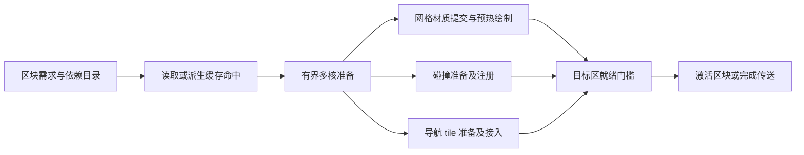

# 引用地图性能续修（2026-10-08）

用户要求继续优化 `medieval_river_town`。本轮保持 v2 引用格式，正式地图只读；修改、另存为和 HTTP 验收全部使用临时地图。GPU 场景通过 `tools/run_godot_background.py` 独立桌面运行。

## 已复核并实施的保存优化

原 32 MiB 编码热缓存遇到城镇约 135 MB 的唯一资源定义，会反复清空，普通位姿保存仍重新压缩所有定义。本轮保留热缓存的深相等检查，增加最多 16,384 项的内容身份索引，仅存原始内容 SHA/长度与已验证压缩资源 SHA/长度。冷开通过完整资源 SHA、解压和合法性检查后填充索引。每次保存仍检查当前定义、序列化并计算完整 SHA，嵌套修改会生成新资源；目标已有资源仍完整读取验证，缺失或另存为才按需压缩。没有扩大大型数据缓存，也不以 mtime、32 位 Variant hash 或旧文件名代替完整性验证。

城镇纯资源保存探针：4,437 个物件、1,762 个定义；移动与删除均 0 次压缩、0 资源写入，资源阶段约 3.4 秒，仍完整检查约 97 MB 磁盘资源。身份索引序列化约 379 KiB。这个计时不含完整 UI 业务校验和发布，不能直接当作 Ctrl+S 总耗时。首次资源生成需要额外原始内容 SHA；另存为仍需写入缺少的资源。

保存业务校验和缺失素材检查在单次操作内复用重复路径检查；每次保存重新建立模型路径集合，并在分帧检查末尾重新检查其权限与存在性。完整逐实例业务校验保留。该末尾模型复核只覆盖 `kind=asset` 路径，不宣称额外覆盖所有贴图和套件。

`save_world` 参数、工具清单及分发不变，UI 与 MCP 共用保存作业。`timings.export` 增加 `identity_cache_hits`、`serialized_raw_bytes`、`compression_count`、`identity_cache_entries`；`encoded_raw_bytes` 表示实际送入压缩的字节数。命中资源身份仍可能序列化和 SHA，不应称作完全零处理。

## 已复核并实施的游戏加载优化

由 subagent 调用本机 Grok 初审后逐项复核。资源引用完成 SHA 校验、依赖闭包和顺序核对后，以定义 SHA 复用面材质检查；实例状态白名单不能覆盖材质定义，逐实例位姿、楼层、活动件及业务校验仍执行。已验证的贴图请求提前后台解码，与模型及地形准备重叠；取消和失败路径回收贴图线程。

只读 CPU 对比中，材质所在的串行批次验证 1,864 → 525 ms，贴图请求集合一致。不能将这一局部数字直接当作整个游戏加载收益。Grok 所提重复 SHA、缺少拾取缓存、直接跳过模型导入等推测不符合源码，未采用。

## 测试及证据

- `test_map_resource_store.gd`：79 PASS，含冷开、嵌套修改、缺失、另存为、损坏、并发、hash 碰撞及有界索引。目录 junction 通过；文件 symlink 夹具因本机权限跳过。
- `test_reference_map_loading.gd`：40 PASS，含同定义不同状态/位姿、损坏资源不能授予身份、逐实例非法值拒绝、贴图工作提前启动及取消回收。
- `test_reference_save_validation.gd`：9 PASS，含单操作路径复用、验证中删除、修复后新操作可见及越界拒绝。
- `test_reference_map_save.gd`：30 PASS，含最终资源变动、并发主文件写入、发布故障、撤销资源复用和标准 glTF 代理解析。
- `test_reference_map_recovery.gd`：14 PASS，含 v2/迁移检查点、损坏拒绝、缺失主文件恢复与地图目录过滤。
- `test_reference_cursor_validation.gd`：27 PASS，含同定义不同实例状态、非法实例、非根节点、同步/分帧一致、坏 prefab、最终路径 junction 替换拒绝。
- `test_reference_map_http.gd`：独立桌面真实 3D HTTP 回归失败数 0；包含真实 GLB 添加/删除、撤销重做、修改、非法调用无副作用、保存重开、发布失败/冲突以及游戏实际模型材质和碰撞。
- 原始报告位于 `D:/code/rmmo_runtime/review_artifacts/`：`map_resource_store_20261008.log`、`reference_encoding_town_20261008.log`、`reference_save_validation_regression_20261008.log`、`reference_map_http_20261008.json`、`reference_load_audit_20261008/review.txt`。

## 编辑器加载测量边界

`profile_reference_editor_load.gd` 通过真实 HTTP `open_world` 触发实际分帧加载；同一临时检查点用新进程重复，避免把同步 `attach_editor` 构建当成用户入口。

本轮初始基线总耗时 107.679 秒、最大帧间隔 825.323 ms；校验 18.685 秒、构建阶段 88.411 秒，其中 32 个首次使用模型的串行解析等待 36.798 秒。各层嵌套计时不能相加。13,314 次 node 调度并不是逐记录校验三遍，实际公共与文档记录校验各 4,437 次。初版探针的物理射线检查失败，加载记录/身份及元数据检查通过；该基线只用于计时，不称作完整验收通过。

编辑器本轮实施三类改动：

1. Cursor 只对已完成引用校验的根记录传入私有材质身份，复用重复面材质检查；模型路径单次去重、完成前重新核验权限。非根额外记录、旧格式和外部静态调用不借用该身份，缺失模型仍沿用编辑器原有占位语义。
2. 在现有引用读取线程预热唯一 prefab 的 CPU 解码缓存，全部实例业务校验仍运行；不增加一份城镇副本，也不在该线程创建节点、网格或材质。同步打开同样通过该线程，线程启动失败则沿用原校验流程。
3. 素材库作用域建立后提前解析下一个唯一模型，让模型解析与地形/物件准备重叠。最多一个资产线程、一个未消费 GLTF 状态；仍按原记录顺序在主线程创建场景、写共享缓存、释放状态后调度下一个。结束/退出均回收线程，失败缓存限本次加载。

MCP 和 UI 继续共用 `load_job`。`timings.asset_lookahead` 报告唯一模型数、开始/消费/就绪数、启动失败和最大未消费数；`asset_wait` 是消费时剩余等待，`asset_parse_worker` 是完整后台工作，两者不可相加。`timings.validation` 增加已验证材质身份/模型路径数和 prefab 后台预热统计。新进程对比不清空系统文件缓存，不称作磁盘冷启动。

最终 `reference_editor_load_after_20261008.json` 完整验收失败数 0：

| 实际 HTTP 编辑器加载 | 初始基线 | 本轮 |
|---|---:|---:|
| 请求至作业完成 | 107.679 s | 101.237 s |
| 验证阶段墙钟 | 18.685 s | 15.993 s |
| 主线程 node 单元累计 | 11.240 s | 2.452 s |
| 首次模型解析剩余等待 | 36.798 s | 33.540 s |
| 最长帧间隔 | 825.323 ms | 801.952 ms |

699 个 prefab 后台预热 7.665 s，这部分是转移到后台，不是工作消失。32 个模型全部按序消费，4 个消费时已就绪，最大未消费数 1；总加载仅改善约 6%，不夸大为秒开。4,437 条记录和元数据与独立重开一致，4,437 个独立视觉节点及 6,189 个拾取体身份正确；5 个实际射线命中独立 UUID，HTTP 选择通过，检查点 SHA 不变。原射线探针单向短线且集中于相邻地形；修订为全城采样及双向射线后通过，没有修改生产碰撞来迎合测试。两轮截图均已查看，正式场景未写入。

`test_editor_asset_preparation.gd` 最终独立桌面真实 HTTP 回归失败数 0：两个唯一模型只各解析一次，提前启动/容量/退出清理通过；地形雕刻、区域遮罩、撤销重做和保存重开通过，损坏模型占位、修复后重新加载通过。日志中的 glTF 解析错误是主动写入坏模型的预期夹具，无脚本错误。生产主线程依然有完整资源末尾复核和原生大型形状构建长单位，最长帧并未显著改善。

最高优先级总项仍开放：游戏反馈坐标卡顿、编辑器大型模型的单次碰撞构建、地图加载和持续镜头移动需分别验收，不能用保存提速代替。

## 整城保存及游戏实际验收

`reference_map_town_20261008.json`：4,437 个原有物件，通过真实 HTTP 添加共享素材库的「方窗石砌窗套」GLB，完整记录、材质贴图、独立身份、碰撞和撤销重做通过，失败数 0。正式地图及原模型/素材库 SHA 不变。

| 操作后的保存 | 上轮 | 本轮 | 新写定义 / 实际压缩次数 |
|---|---:|---:|---:|
| 移动已有模型 | 9.645 s | 7.158 s | 0 / 0 |
| 添加此前未用模型 | 9.675 s | 7.441 s | 1 / 1 |
| 撤销添加 | 9.873 s | 7.953 s | 0 / 0 |
| 重做添加 | 9.437 s | 7.445 s | 0 / 0 |
| 删除模型 | 11.655 s | 7.250 s | 0 / 0 |
| 撤销删除 | 9.171 s | 7.190 s | 0 / 0 |

所有阶段 0 图片导出；新增模型业务操作本身约 541 ms，与随后保存计时分开。首次写入新的临时资源目录 26.103 s，写入 1,762 个定义；这不是已有地图普通保存。常规保存业务校验约 2.1–2.7 s，资源编码约 2.5–2.6 s，剩余为完整磁盘校验、小型地图序列化及原子发布。

游戏 MapLoader 总耗时本轮 58.049 s，上轮 58.213 s，整体基本未变；这是同进程编辑器准备后的 MapLoader 局部计时，不包含完整进入游戏过程，也不是新进程首次进入时间。实际恢复 6,190 个流式条目，新增模型真实网格、4 张可读贴图及附近 29 个碰撞体通过。本轮不据此关闭游戏加载或坐标卡顿待办。

## 游戏附近优先加载（2026-10-08 续修）

用户调整顺序为先游戏、后编辑器，并要求区块及物件都优先准备角色附近。新增 `profile_game_entry.gd` 从真实 `GameSession.go_world_3d()` 经过 loading、MapLoader、导航、HUD、第一帧和淡出，到角色可操作计时。使用同一临时城镇检查点，每次新进程；只清理该临时地图的派生网格缓存，不清系统文件缓存，不称物理磁盘冷启动。

旧流程完整首次进入 97.008 s，派生缓存存在时 97.082 s；32 个外部 GLB 合计约 2.8 GiB，首次串行解析约 48.285 s。旧缓存即使读到 1,000 个网格，因普通模型记录未写入原生缓存而误判全部 spec 不完整，实际恢复数为 0。修复缓存 UUID 闭包及固定头身份校验后，普通模型缺省槽不再使原生缓存整体失效；旧格式和身份不匹配在读取大型 payload 前拒绝，命中仍完整校验。

游戏加载入口现按目标位置准备：

- 初始 ±96 m 范围内以及无法可靠判定静态边界的模型沿原严格流程准备；远处静态自包含 GLB 读取边界清单，完整 SHA、解析、场景和 CPU 碰撞数组交由独立后台队列。
- GLB 边界来自标准 accessor min/max、节点变换和实例变换，不冒充扫描了所有 BIN 顶点。动画、蒙皮、morph、特殊实例生成器及未知格式走提前准备；后台再次验证 JSON 边界快照、完整文件 SHA 和原生地图标记。
- 物件按当前请求位置到世界包围盒的距离选择。同路径只准备一次，但其远处实例不能排在另一种近处模型前；玩家位置变化会重新排序。独占模型资源完成后才在主线程写素材库，增量追加空间索引、导航和小地图，保留作者记录、UUID、变换、活动件与楼层语义。
- 发布按约 2 ms 片段调度，单个物件仍可能超出该预算。worker 预捕获独占三角 ArrayMesh；必要时预热精确碰撞面，不能称物理形状构建和 GPU 上传成本已消失。
- 同区块计划进行时，新发布项先累积，不反复取消正在准备的碰撞。角色行走仅等待脚下 4×4 m 安全范围及实际碰撞；远处任务不阻止本地放行。缺少脚下几何时暂停重力，普通 UI 输入锁仍保持原物理行为。
- 几何未齐时禁止全图导航缓存读写与“全图已就绪”标记。完成后加入全部模型来源 SHA，再恢复全图后台导航；小地图追加真实新条目，已有绘制 RID 保留。

当前仍需提前完成完整引用资源校验、原生地形邻接上下文和原生几何目录；这些目录按距离准备，但没有全部改成按需读取。实际渲染/碰撞沿用区块驻留，远处外部模型为本轮主要延后对象。编辑器加载路径不在这次游戏队列变更范围内。

回收专项发现并修复两项真实问题：退出时主线程同步等待 GPU worker 会死锁；未发布场景直接销毁会先释放材质而渲染实例仍活。现由 SceneTree 所有的回收器取消并异步 join；应用退出刷新渲染命令，销毁期间暂持网格/材质资源。没有用跳过测试或吞错误处理。

`test_deferred_asset_scene.gd` GPU 对照覆盖完整网格、贴图、草色、叶片背光、可见范围、打包后 CPU 缓存身份、源变动、取消与退出；坏 JSON 夹具有明确预期日志区间，其余无材质错误。`test_stream_append_runtime.gd` 验证同区块追加、跨区打断、连续 80 帧发布不饿死原碰撞、真实射线、局部放行与按距离实际发布。`test_world_map_append.gd` 增量与完整绘制逐像素一致，`test_runtime_load_caches.gd` 原有真实 GPU 回归通过。

最后增加真实 MapLoader 近远同路径验证：临时引用图同一标准 GLB 放在近处和 304 m 处，初始只解析一次，远实例保留 pending；后台继承已成功准备的不可变场景，后续模型准备次数为 0。两处均有完整网格、材质和真实射线碰撞，缓存场景身份和作者记录保持一致。日志 `stream_append_reuse_final_20261008.log` 失败数 0，无脚本/材质错误。

初版整城延后队列测得 27.846 s 进入、897 个延后实例最终恢复至 6,189 条目，但跨区最终稳定检查失败，且局部放行仍等了约 89 s。因此该轮只是诊断数据，不作为验收通过；之后修正了重复重启区块计划及等待远处工作的门槛。最终复测及传送验收见下文追加结果。

### 整城进入与后台完成实测

| 入口条件（均为新进程） | 改动前 | 附近优先 |
|---|---:|---:|
| 清理临时图派生网格缓存后，完整可操作 | 97.008 s | 30.852 s |
| 保留派生网格缓存，完整可操作 | 97.082 s | 41.925 s |
| 缓存轮原生构建阶段 | 21.564 s | 4.452 s |
| 缓存轮成功恢复原生 spec | 0 | 1,025 |

两轮均通过作者记录、全部元数据、HUD、附近碰撞/导航和源 SHA 检查。缓存轮引用资源解包阶段 19.069 s，明显高于清理派生缓存轮的 4.834 s；该波动原因未确认，不能说命中缓存必然更快。另一轮真实城镇传送探针的新进程进入为 26.282 s，记录为独立样本，不用它替换较慢的缓存轮结果。

`game_entry_chunks_cold_20261008.json`：897 个延后实例、32 个模型全部完成，总计 6,189 个流式条目；后台完成耗时 113.426 s，最后区块收尾 1.092 s。压力探针直接将位置移至未驻留桥头，2.643 s 后脚下物件/碰撞就绪即可恢复移动，远处队列继续执行。这是流式保护压力测试，不冒充正式传送入口。捕获 88 个共享网格，CPU 数组约 68 MB、碰撞面约 17 MB；后台单次发布最大 7.147 ms，整帧仍测到 230.492 ms。持续帧率和密集区首次模型处理仍未完成优化。

### 传送 loading 验收

用户新增要求：目标区块未准备时显示 loading，完成后才进入。现使用独立全屏传送遮罩，显示阶段、条数及耗时；先绘制遮罩，再解析目标。等待期间冻结角色输入和物理、暂停旧地图后续素材调度，并暂停遮罩下无效的 3D 绘制。目标附近模型、实际碰撞、初始导航、渲染批次、风场/灯光材料和小地图准备完毕后，才检查落点及 `before_commit`，完成地图提交；目标首个绘制帧后撤下遮罩。取消条件/缺失地图/堵塞/没有导航表面保持旧地图与状态，不提前消耗提交条件。UI/MCP 编辑器能力未新增，此处为游戏运行时行为。

`test_transfer_loading_gpu.gd` 通过真实 `GameSession.go_world_3d()`，使用标准自包含 GLB 证明同图 300 m 远处确有未发布素材，再测试同图远传、跨图、缺失地图、堵塞落点、无可行走表面和提交条件变化。检查加载期间原位置、冻结物理、遮罩先于读取、目标导航实际路径、失败地图/导航/战斗对象身份、恢复绘制与旧队列、最后小地图及首帧就绪。

`town_transfer_final_20261008.json`：同一城镇临时检查点，进入后直接传到 `(292.9, 151.4) m` 附近；Y 来自已加载原生桥面三角求交，角色中心高度约 1.797 m，不猜落点。目标区确有未准备普通模型。全程遮罩、禁止提前落点/恢复输入、实际附近模型/碰撞/导航、小地图和正式源 SHA 检查失败数 0；加载画面与最终桥头截图已查看。

本次真实传送耗时 **93.780 s**。目前同图远传仍走隔离准备并提交整图的既有事务，目标 ±96 m 内涉及大量首次模型；没有宣称传送提速或只构建一块。首次密集区传送、全引用校验及原生目录构建继续列为性能最高优先级。

退出时少量 `RefCounted` 的 ObjectDB 告警已作对照：改动前 `game_entry_before_wrapper_20261008.log`、`game_entry_before_warm_wrapper_20261008.log` 均有 10 项；本轮完全不传送的 `transfer_entry_baseline_20261008.log` 仍有 7 项。显式等待导航烘焙、自建线程、所有 loader 退休及 drainer 清空后，传送专项仍有 4 项，151 个被追踪候选均未匹配。能够确认改动前已有同类退出告警，且不依赖传送；具体对象来源未确认，单独保留生命周期排查，不能宣称泄露已修复。关键线程队列的退出/取消检查通过。

## 硬件协同资源流水线：优化方案补充（调研，尚未实施）

2026-10-08 用户要求继续参考游戏技术文章和论文，针对昨晚 CPU、GPU 都未充分利用的现象补充架构设计。本节记录当时的研究方案；随后获授权添加监控并测量，结果与调整见下节。流水线改造仍未实施。此前探针主要记录阶段墙钟和帧间隔，没有足够的逐线程 CPU、GPU 队列及等待数据，不能据此确认是哪一阶段限制了吞吐。

这项设计纳入最高优先级，与前述“本区块优先、按需准备、同图传送只准备目的区域、分块派生缓存”一起实施。目标是缩短必需区域的准备时间，并减少行走、传送和编辑过程的长帧。CPU/GPU 利用率用于解释流水线中的空档；帧率受限、loading 下暂停旧场景绘制和缓存已经命中时，低利用率可以是正常结果。

### 游戏技术及论文依据

下表区分学术论文、游戏开发演讲和引擎文档。GDC 的两项多核演讲本轮读到官方摘要，不冒充已观看完整视频。其余列出的 PDF 已读取相关章节；Sunset 与 Nanite 大型 PDF 的文字提取副本位于 `D:/code/rmmo_runtime/review_artifacts/hardware_pipeline_research_20261008/`。

| 资料 | 对方案的直接启发 | 本项目采用范围 |
|---|---|---|
| Bungie / Barry Genova，GDC 2015：[Multithreading the Entire Destiny Engine](https://www.gdcvault.com/play/1022164/Multithreading-the-Entire-Destiny)；官方摘要 | 细粒度任务图、系统流水线与数据并行；显式追踪资源读写和生命周期。 | 地形、模型、碰撞、导航采用统一任务依赖和资源所有权，先用现有线程池能力表达任务图。 |
| Naughty Dog / Christian Gyrling，GDC 2015：[Parallelizing the Naughty Dog Engine Using Fibers](https://www.gdcvault.com/play/1022186/Paral)；官方摘要 | 多核任务调度需要同时处理帧组织、内存分配及锁。 | 消除批次等待空档、约束共享资源访问；不将自研 fiber 系统列为先决条件。 |
| Insomniac / Elan Ruskin，GDC 2015：[Streaming in Sunset Overdrive's Open World](https://media.gdcvault.com/gdc2015/presentations/Ruskin_Elan_SunsetOverdriveStreaming.pdf)；游戏流送工程演讲 | 资源初始化的 CPU 峰值可以比磁盘读取更突出；把确定性准备前移到构建阶段，并把空间驻留与不同资源的流送分开管理。参见 PDF 第 123、128–134、164–175 页。 | 导入时预编译；共享模型只准备一次；区块控制实例驻留，缓存控制共享资源驻留，卸载采用回滞。 |
| Ubisoft / Ulrich Haar、Sebastian Aaltonen，SIGGRAPH 2015：[GPU-Driven Rendering Pipelines](https://advances.realtimerendering.com/s2015/aaltonenhaar_siggraph2015_combined_final_footer_220dpi.pdf)；游戏渲染工程演讲 | 静态实例数据持久驻留 GPU，动态变换通过缓冲更新；按材质/状态组织绘制，并由 GPU 做实例、簇级剔除，避免同步往返。参见 PDF 第 12–20 页。 | 先继续完善当前分组静态合批、重复模型实例化及变换增量提交；完整 GPU 间接绘制属于引擎级后续路线。 |
| Epic / Brian Karis，SIGGRAPH 2021：[Nanite: A Deep Dive](https://advances.realtimerendering.com/s2021/Karis_Nanite_SIGGRAPH_Advances_2021_final.pdf)；游戏几何流送工程演讲 | 小型层次元数据保持驻留，细节按需求分页；请求有优先级并异步完成，低优先级页可驱逐。参见 PDF 第 124–127、138 页。 | 借用轻量目录常驻、按需求准备、按字节限制在途资源的原则；不计划移植 Nanite。其 PS5 转码性能不作为本项目估算。 |
| AMD：[RDNA Performance Guide](https://gpuopen.com/learn/rdna-performance-guide/)；包含 RDNA 3 的官方工程指南 | 减少零碎提交和同步，让 CPU 准备与 GPU 工作重叠；async compute 需要匹配工作负载，并非添加计算队列就有收益。 | 批量准备上传描述、减少重复资源更新；低层命令缓冲/队列控制留在 Godot 渲染后端可支持的范围。 |
| Blumofe、Leiserson，JACM 1999：[Scheduling Multithreaded Computations by Work Stealing](https://www.cs.utexas.edu/~venkatar/sys_perf_analysis/ws_theory.pdf)；学术论文 | 对文中 fully strict 任务，执行时间受总工作量除以处理器数量及关键路径共同限制。 | 用就绪任务持续补充空闲 worker，缩短必需区依赖链；论文界限不直接套用于带 I/O、GPU 和引擎锁的任意任务图。 |
| Williams、Waterman、Patterson，Berkeley 2008 技术报告：[Roofline](https://www2.eecs.berkeley.edu/Pubs/TechRpts/2008/EECS-2008-134.pdf)；多核计算论文 | 算术吞吐和内存带宽都可能成为上限；减少数据搬运、改进连续访问与向量化影响多核收益。 | 对地形和几何热点采用连续数组、共享不可变数据；该模型不是完整游戏加载器的耗时预测。 |
| Burns、Hunt，JCGT 2013：[The Visibility Buffer: A Cache-Friendly Approach to Deferred Shading](https://jcgt.org/published/0002/02/04/paper.pdf)；实时图形学论文 | 用紧凑的可见性数据降低 GPU 工作集与带宽消耗。 | 作为渲染数据组织的研究参考。当前没有证据要求重写 Godot 的着色管线，不列入近期实施。 |

### 与当前代码对应的限制

- `scripts/world3d/model_parse_preparation.gd` 的并发限值为 1–2；每一批全部 join 后才启动下一批。当两个模型耗时不同，已完成的一侧不能立即补入下一个任务。该限制原本用于资源独占与回收安全，扩大并发必须保留这些约束。
- `scripts/world3d/deferred_asset_loader.gd` 当前只有一个模型准备 worker；完成后消费和发布，再安排后续模型。其队列最终仍会准备所有 pending，尚未成为具有驻留上限的按需系统。
- `map_loader.gd` 的 prefab、贴图、地形遮罩等已有多线程，`ground_batcher.gd` 也有最多三个 worker。当前缺少跨子系统的统一并发和内存预算，不能把整个加载过程描述成“只有一个线程”，也不能独立把每个上限都提高到核心数量。
- 部分模型场景生成、物理形状构建、注册和提交仍有较大的单次操作。现有约 2 ms 发布预算只能在操作之间让出，不能打断一个已经开始的原生调用。
- `map_resource_store.gd` 的 32 MiB 热数据缓存满时整池清空；此前加入的内容身份索引已避免大量重复压缩，但大型数据缓存仍需单独管理。素材库的静态 `_scenes` 缓存也没有统一容量及驱逐策略。
- 同图远传当前仍隔离构建整图；native 几何及导航的某些派生阶段仍有整图依赖。只提高并发无法去掉这部分额外工作。

### 新增环节：从区块请求到硬件协同准备

请求单位沿用当前 32 m 逻辑区块。磁盘包、渲染批次和导航 tile 各自选择合适粒度，并保留地形采样/过渡的邻接范围。每个区块形成独立依赖图，按必需落点、当前可见区、运动前方及远处预取排序；任务加入等待老化，防止持续移动饿死必要收尾。



**1. 导入/构建阶段生成可直接消费的运行时资源，列为 P0。**

保留 v2 作者地图与外部原始模型引用，新增可丢弃的派生构建产物。按资源内容 SHA、依赖 SHA、生成器及引擎版本，缓存标准化网格数组、材质描述、所需 CPU 碰撞数据和引擎可加载的场景资源；地形及导航按区块版本缓存。优先验证 Godot 原生资源能消除多少重复 glTF/PNG 解析，再决定是否需要专用二进制包。碰撞面数组缓存不等于物理服务器内部加速结构已经可持久化，该成本仍须验证。

贴图优先利用引擎支持的 mip 与 VRAM 压缩格式，避免每次运行都从大 PNG 解码并上传完整原图；格式适配、法线/透明通道和视觉质量需单独验收。依据：[Godot 图像导入说明](https://docs.godotengine.org/en/stable/tutorials/assets_pipeline/importing_images.html)。首次导入允许较高并发；已有资源冷进程加载复用磁盘产物。修改物件位置仅失效所在区块的实例派生数据，不能重新处理共享材质/贴图或全地图。

**2. 统一就绪任务调度与资源所有权，列为 P0。**

使用长驻 worker/现有 `WorkerThreadPool` 执行独立的数据任务；计算 worker 仅执行依赖已满足的任务。读取等待使用单独的有界读取队列；完成一个模型即可安排下一个，取消两两批次屏障。几何、贴图解码、SHA、碰撞数组和导航准备共享应用层并发预算；Godot 内部线程数量也纳入观察，不假定外层四个任务只使用四个核心。

本机 6 个物理核心、12 个逻辑线程，候选总计算并发以 2/4/6 对比，初始实验档可取 4；更高核心机器按吞吐和帧时间逐步扩展。loading 与交互使用不同预算，加载期间扩大必需区准备能力，交互期间为主线程、渲染、物理及用户其他应用留余量。读取并发与计算并发分开调整。

任务写入自身拥有的输出，以只读结果交接；同内容共享一个 preparation future，多个区块引用同一结果。任务包含内容身份、区块 generation、优先级、估算输出字节及取消标记。版本过期结果丢弃，失败明确传播，退出沿用已验证的异步回收机制。共享材质、场景缓存及 glTF 扩展注册表不得被并发改写；默认 glTF 解析接口涉及哪些引擎资源需重新审核，不能仅取消限值。处于同一池中的任务避免阻塞等待池内子任务。

依据：[Godot WorkerThreadPool](https://docs.godotengine.org/en/stable/classes/class_workerthreadpool.html)、[Godot 线程安全边界](https://docs.godotengine.org/en/stable/tutorials/performance/thread_safe_apis.html)。活跃 SceneTree 的变更保持在主线程提交；不能因增加 worker 绕过场景/渲染资源线程安全要求。

**3. 用内存连接各阶段，列为 P0。**

分别核算活跃区资源、CPU 派生缓存、已完成待提交结果、GPU 资源和传送暂存区。以字节而非单纯条数限制在途工作：结果队列达到高水位即暂停低优先级准备，消费至低水位后恢复。容量满时逐项驱逐最久未使用且未被 pin 的资源，避免整池清空；当前位置与传送目的地必需资源不得被驱逐。

共享模型的网格、材质和贴图按内容身份常驻，实例主要保存变换和语义；CPU 数组尽量只读共享，避免多份大 Dictionary 深复制。CPU/显存分别设预算，CPU 缓存不要求全部上传 GPU。卸载有距离和时间回滞，避免区块边界往返反复加载。当前、目的地、在途解码和上传临时内存一起计算峰值，传送成功后才退休旧区域。

本机 CPU 缓存可将 2/4/8 GiB 作为独立实验变量，实际上限按可用内存和其他应用占用动态下降，并预留系统空间；这些数字是调参候选，不是生产默认值。显存使用设备预算、实测驻留及峰值决定，不能由“内存很多”推导无限驻留。

**4. 让 GPU 提交与下一批 CPU 工作重叠，列为 P0。**

CPU 就绪结果按区块和材质准备批量上传描述；主线程/引擎提交小而受限的网格、贴图及实例变更，同时 worker 准备后续区块。交互保留约 1–2 ms 的应用层提交起始档，loading 按 UI 响应和实际帧余量扩大；同时设置提交字节数、原生资源数及最长单操作限制。对于单次不可拆操作，优先在构建阶段拆成可消费的资源块，或在必需区 loading 中提前完成，不能用循环时间预算声称已切片。

资源共享和静态批次减少 CPU 逐节点、逐 surface 提交；重复网格可评估按区块的实例化，移动物件只更新变换/局部批次。房屋按楼层、屋顶/天花板及材质分组，活动门窗保持独立；独立选择、UUID、碰撞和作者记录继续存在。建筑长距离可见与本区块近景细节分开驻留，保持当前写实外观及自动合批要求。

新增明确的 `CpuReady`、`RenderReady`、`CollisionReady`、`NavReady` 状态。`CpuReady` 不能触发角色放行；必需区域满足实际碰撞、导航接入、渲染提交和目标首帧后才通过就绪门槛。loading 下旧场景暂停绘制的机制需要允许目标区域必要的引擎预热帧，否则 GPU 预热不能真正执行。

提前创建目标区将用到的材质/网格组合及相关渲染特性，在遮罩下绘制最小预热视图，复用 Godot 的 pipeline 预编译与后台 specialization。不为预热加载整城所有组合。依据：[Godot pipeline 编译说明](https://docs.godotengine.org/en/stable/tutorials/performance/pipeline_compilations.html)。该步骤减少首次看见新模型时的潜在编译长帧；当前坐标卡顿尚未证实由 pipeline 导致。

**5. 选择适合留在 GPU 的工作，作为条件性的 P1/P2。**

可候选的工作包括大批量实例可见性/LOD、纯视觉地形遮罩和混合图、草木风场等，优先选择输出直接被渲染消费且无需每帧读回 CPU 的任务。需精确参与角色碰撞、导航及编辑撤销的权威数据继续有 CPU 表示，避免 GPU 结果同步读回重新阻断流水线。

先充分使用现有 Godot 实例化、LOD、遮挡与合批能力。若 CPU 绘制提交仍是已测热点，再评估原生扩展或渲染后端的 GPU 剔除/间接绘制；`RenderingDevice` 的计算能力不等于应用脚本能控制内建渲染器的异步队列。GPU 转码、完整 virtual texturing、visibility-buffer 渲染和自研 Nanite 不列为近期交付。必要的少量 CPU 几何热点可在数据布局调整后移入 GDExtension，保持脚本业务接口及资源校验，不整体重写引擎。

### 纳入原方案的顺序与验收

实施依赖顺序为：**本区块需求/版本与就绪协议 → 资源预编译及内容缓存 → 统一任务调度与有界缓存 → 分段提交及局部预热 → 同图传送双驻留 → 条件性的 GPU 计算优化**。前四项为 P0，可在协议明确后按独立资源类型逐步接入，避免先扩容线程再处理资源共享。编辑器随后复用同一派生资源和调度器，位置更新/添加/删除只更新相关区块；若新增用户或 MCP 参数，UI 与当前 3D MCP 同时交付。

验收使用城镇原有三处反馈坐标 `(262.7, 125.8)`、`(292.9, 151.4)`、`(321.2, 160.3)`，覆盖首次进入、连续行走、返回刚卸载区域、同图未驻留远传和跨图传送；编辑器覆盖首次打开、单模型/大预制件添加、连续移动、删除、撤销重做及保存重开。保持临时地图和不激活独立桌面测试约定。首进与缓存命中分开报告，不能把新进程等同于磁盘冷读，也不能以 loading 隐藏长帧宣称交互卡顿修复。

每个阶段记录排队/执行/完成待消费时间、产物字节及缓存命中；记录整体可操作时间、传送时间、P95/P99 帧间隔、最长原生操作与 CPU/显存峰值。逐线程 CPU 时间及 GPU 提交/执行时间用于判断下一步：就绪任务很多而 worker 空闲则修调度；CPU 忙而 GPU 无命令则修准备/提交；待提交结果堆积则修发布；GPU 已有足够命令但执行慢才处理着色/带宽/几何工作。GPU 时间捕获受本机工具和驱动支持约束，采集不到时注明缺项。

预期收益按优先级分别来自：消除重复导入；让不同资源阶段重叠；降低资源准备的批次空档；减少主线程零碎提交和首次编译；只准备必需区域。具体收益须实测确认。现有 30.852/41.925 秒首次进入与 93.780 秒同图远传仍是实施前证据，本节没有新的提速数字。

## 加载监控实测与方案修订（2026-10-08）

用户随后授权“加监控点，跑游戏和内容编辑器加载，确定卡点并修改方案”。本次实现诊断和探针，没有实施上文的资源预编译、任务池、区块解包或调度预算改造；不把计时波动写成优化收益。正式地图未修改，性能最高优先级总项保持开放。

### 入口和测量边界

两条真实入口使用同一临时 v2 城镇检查点 `reference_load_checkpoint_26004507/map.gltf`：4,437 个作者记录、1,762 个定义；897 个普通 GLB 实例对应 32 个模型，原始 GLB 约 2.8 GiB。检查点及正式地图主文件 SHA 均为 `c2fe187dba08978b873515bb3877830262ff2ee7608e7fa9a56b24a9201c6e3a`。

游戏从 `GameSession.go_world_3d()` 测至 loading 撤下、角色可操作，另测 10 秒后台活动；完整远处队列另有一次观察。编辑器通过真实 3D HTTP `open_world` 测至加载作业完成，另测桥区静止视图 10 秒；记录/身份/射线校验位于计时结束后。

GPU 场景均经独立桌面包装器串行运行，未激活窗口。Godot 4.7.2 / Vulkan、RX 7900 XTX、60 FPS 上限；i7-7800X、6 个物理核 / 12 个逻辑线程、32 GiB RAM。未清系统文件缓存、驱动 shader cache，也未关闭用户其他应用；新进程不是严格物理磁盘冷启动。

`load_trace.gd` 默认关闭，启用后在内存记录阶段、线程、UUID/模型路径及起止时间，最多 40,000 个不短于 0.5 ms 的事件，同时累计短调用统计，worker 不写日志。覆盖引用读取/SHA、解压、安全校验、实例复制、prefab 预热、模型解析/生成、地形/贴图准备、主线程构建、拾取 shape/body、派生缓存、完整性复核、角色准备及渲染提交区间。

`load_monitor.gd` 每 200 ms 记录视口 CPU/GPU 绘制时间、更新模式、pipeline 编译数量、内存及 draw calls，逐帧记录阶段帧间隔；通过 `node_added` 发现新视口，不周期遍历全城。`profile_load_hardware.py` 约每 0.6 秒记录目标 PID 的进程/原生线程 CPU、逻辑读取量、RSS/private bytes、分 engine GPU 活跃时间与显存；`summarize_load_monitor.py` 对齐时钟，交错阶段按不相交区间累计。

诊断限制：Godot trace 线程 ID 与 Win32 TID 不可直接匹配；原生主线程由 CreateProcess 返回值确定。CPU 当量是 CPU 秒 / 墙钟秒，不等于物理核心数量；短命 worker 的逐线程 CPU 可能漏采，进程 CPU 仍有覆盖。读取量包含系统缓存命中，不等于磁盘吞吐。GPU 百分比取同类型最高的单 engine，不能将多个 engine 相加；视口 GPU 时间也不等于渲染提交墙钟。UPDATE_DISABLED 视口可能保留旧时间。没有原生锁等待栈、GPU fence 或精确上传时间；重叠不能单独证明磁盘、锁或 shader 编译根因。

第一版周期扫描视口在编辑器每次平均约 13.9 ms，会污染帧时间。取消扫描后最终编辑器采样平均 **0.078 ms**、最大 **0.244 ms**；游戏平均约 **0.075–0.082 ms**。下表用最终版本，初版只保留阶段/波动线索。外部 PDH 每次自身约 52–60 ms，位于独立 Python 进程，不纳入 Godot CPU，但仍有系统开销；不是零开销基准。

### 最终实测

| 真实入口 | 可操作/完成时间 | 最长加载帧间隔 | 平均 CPU 当量 / 12 线程总占用 | GPU 3D engine 平均 |
|---|---:|---:|---:|---:|
| 游戏，清除该临时图派生缓存 | 28.876 s | 3,129.659 ms | 2.182 / 18.18% | 1.52% |
| 游戏，派生缓存存在的新进程 | 20.907 s | 2,954.537 ms | 1.866 / 15.55% | 1.79% |
| 编辑器，真实 HTTP 打开 | 106.763 s | 873.806 ms | 1.048 / 8.73% | 1.95% |

游戏两轮峰值 RSS 约 3.72 / 3.54 GiB、private bytes 4.94 / 4.72 GiB、独立 GPU 内存约 1.81 GiB；编辑器约 5.13 / 8.93 / 4.82 GiB。private bytes 不能全部当成物理内存驻留，CPU/GPU 两份数字也不直接相加为统一工作集。

最终三轮失败数均为 0，硬件采样无错误、trace 无丢弃。编辑器保留 4,437 个独立视觉、6,189 个 UUID 正确的拾取体，5 个实际射线及 HTTP 选择通过；游戏作者记录/元数据、HUD、附近碰撞/导航和主文件 SHA 检查通过，截图已查看。纯逻辑引用加载 40 PASS、模型准备 14 PASS，监控 smoke、不相交区间汇总与真实 GPU 后台资产回归通过。原有游戏退出 ObjectDB 告警仍单独保留。

| 热点 | 证据及含义 |
|---|---|
| 游戏提前准备原生目录 | 无派生缓存 parser 11.031 s、主线程构建 11.689 s；命中后分别 10.435 / 4.270 s，恢复 1,000 个网格 / 1,025 个 spec。缓存有效，但完整引用、prefab 和原生目录仍有成本。嵌套/并行计时不能直接相加为入口耗时。 |
| 地形/贴图已并行 | 无派生缓存地形准备 4.755 s，进程约 5.73 个 CPU 当量；贴图解码 2.530 s，与其他 worker 重叠时约 7.91 个 CPU 当量。不能称全流程没有利用多核，不能优先把各子池都扩至 12。 |
| 引用还原和小文件读取波动 | 最终游戏还原 4.587 / 4.423 s，编辑器 4.364 s。初版另测游戏 22.280 s，完整入口 51.312 s，资源读取/SHA 显著变慢；最终游戏 7,048 次读取/SHA 累计 2.673 s，初版约 18.546 s。没有物理磁盘等待栈，不认定磁盘型号或杀软是根因。 |
| 编辑器模型解析关键链 | 32 个模型解析累计 39.439 s，消费时剩余等待 35.493 s，最大模型约 6.508 s；最大未消费数为 1。prefab 预热 7.878 s、约一个 CPU 当量；转后台不等于消除成本。 |
| 编辑器原生长调用 | shape 累计 5.964 s、最大 246.241 ms；body 注册/发布累计 4.839 s、最大 234.940 ms。mesh 累计 7.731 s、最大 484.551 ms；末尾 signature 779.759 ms，包含依赖、路径及地图复核，并非只给小主文件做 SHA。外层 8 ms 预算不能打断这些调用。 |
| 合批 loading 沿用交互预算 | 收尾等待 7.182 s，进程约 0.52 个 CPU 当量，每帧预算仍为 2,000 μs。35 个 batch 采样中多数尚无已投递几何 worker，4 个有完成 worker 等待消费；支持拆分 loading/交互预算，并继续记录 preparation 子阶段。不是 7 秒纯几何计算。 |
| 首次角色/渲染初始化 | 清缓存轮角色准备 1.221 s，紧接首次渲染提交 1.904 s；命中轮约 1.125 / 1.824 s，覆盖约 3 秒长帧。GPU 负载低且 pipeline 数增长，初始化/提交链是热点；不能证明全由 shader 编译造成。 |
| 后台生成与渲染长帧重叠 | 命中轮可操作后 10 秒仍有后台任务；7 次超过 100 ms 的渲染提交区间，6 次与 `deferred.scene_generate` 重叠。此段帧间隔 P99 约 155 ms、最大 192 ms，视口 GPU 平均约 1.82 ms。需核查原生资源创建/提交/同步，重叠不证明具体锁。 |

初版完整远处队列另测 100.407 s，32 个模型 worker 累计 85.180 s，其中解析 40.935 s、前置 SHA 18.440 s、生成 8.820 s、CPU 捕获 1.075 s；另有末尾完整 SHA，之后已补独立监控，不能把未分解剩余全归解析。该轮有扫描开销，只作为远处流水线量级证据，不是最终严格基线。

编辑器 loading 时地图/素材 SubViewport 为 UPDATE_DISABLED，只画 UI。完成后桥区视口 GPU 平均约 3.52 ms、渲染 CPU 9.73 ms，根视口 CPU 3.10 ms；静止帧间隔 P95 / P99 为 26.33 / 32.23 ms、最大 46.09 ms。它不是镜头移动或整城帧率验收。游戏 loading 低 GPU 活跃也与有限绘制有关；两者都不支持以 GPU 占用达到 100% 为目标。

### 据此调整实施顺序

1. **P0：游戏/编辑器共享的模型、材质与碰撞输入预编译。** 优先消除反复处理约 2.8 GiB 原始 GLB 的解析/生成。区分纯 CPU 数据准备与创建渲染资源的原生步骤，后者即使在 worker 也观察其对 render frame 的影响。受控发布资源采用内容身份、依赖闭包与生成器版本；外部可变原文件仍完整验证，不凭 mtime、大小或旧文件名授予缓存信任。先做同模型对照再扩到全城，不承诺 35 秒等待全部消失。
2. **P0：本区块定义/原生准备，配合小文件 I/O。** 远处普通模型主要已延后，完整引用和原生目录仍处于关键链。新增轻量空间/依赖目录，按必需区及邻接范围读取定义、准备地形/碰撞/导航，评估资源页/包和有界读取并发。保留实际消费的完整 SHA、路径权限、闭包及发布冲突检查；页/包支持局部更新，不重新引入只移动一个物件就全城导出。
3. **P0：已测长单元和调度等待。** 角色资源与准确材质组合在角色选择阶段提前准备并复用，必需资源仍有就绪门槛。编辑器 loading 独立预算，对比合批 2/8/16/24 ms 档并观察 UI 最长帧；交互保留小预算。大型 mesh/shape 在构建阶段合理拆块或缓存，保留独立 UUID、精确拾取、楼层/屋顶隐藏及活动件语义。末尾校验采用可证明的事务/发布方案，不直接删除复核，也不用大循环预算掩盖原生长调用。
4. **P0 配套：有界结果、所有权及缓存；任务池分步统一。** 单模型链先试安全的 2/4 并发与持续补位，按产物字节、CPU/显存及 UI 帧限制在途工作。地形/贴图已有并发，先测后调；全面调度器重写不是预编译/本区块加载的前置条件。交互阶段限制会创建渲染资源的工作，再用原生 profiler/ETW 区分 CPU、I/O、锁及提交等待。
5. **同图传送双驻留仍为 P0，GPU 算法改造仍为条件性 P1/P2。** 同图 93.780 s 的整图隔离重建本轮未重测或提速，继续计划目的区准备与安全提交。本轮没有证据把 GPU compute、间接绘制或渲染器重写排到上述热点之前。预热只覆盖必需组合；持续行走与三个反馈坐标另设专项，不用静止视图代替。

### 复现和报告

探针增加可选 `--monitor`，普通游戏/编辑器不开启；没有新增用户 UI/MCP 参数。编辑器沿用 `open_world` 业务、权限及事务，本次不等同于完成通用 MCP 性能仪表。

硬件包装器使用 Windows PDH 和 `psutil`。本机测试 Python 为 `C:/Users/luna/AppData/Local/Programs/Python/Python312/python.exe`；若默认 `python` 没有 psutil，应使用该解释器。

```powershell
python tools/profile_load_hardware.py --timeout 600 --log <日志绝对路径> --hardware <硬件JSON绝对路径> -- D:/tools/godot/Godot_v4.7.2-stable_win64.exe --path D:/code/rmmo --script res://tools/profile_game_entry.gd -- --map=<临时检查点绝对路径> --output=<入口JSON绝对路径> --monitor
```

编辑器替换为 `res://tools/profile_reference_editor_load.gd`，参数相同。游戏 `--reset-derived-cache` 只清理缓存目录中该临时图的派生缓存；`--wait-deferred` 观察完整远处队列。汇总命令为 `python tools/summarize_load_monitor.py <入口JSON> <硬件JSON> --output <汇总JSON>`。后续探针区分 `playable_background` / `playable_steady`；本次 `playable` 是否含后台工作依上述说明解释。

报告根目录 `D:/code/rmmo_runtime/review_artifacts/`：`game_load_monitor_final_cold_20261008.json`、`game_load_monitor_final_warm_20261008.json`、`editor_load_monitor_final_20261008.json`，各配 `_hardware_20261008.json`、`_summary_20261008.json` 及日志；完整远处队列保留在 `game_load_monitor_cold_20261008.json`。原始事件留供原生等待分析，不将重叠阶段累计相加为总加载时间。
