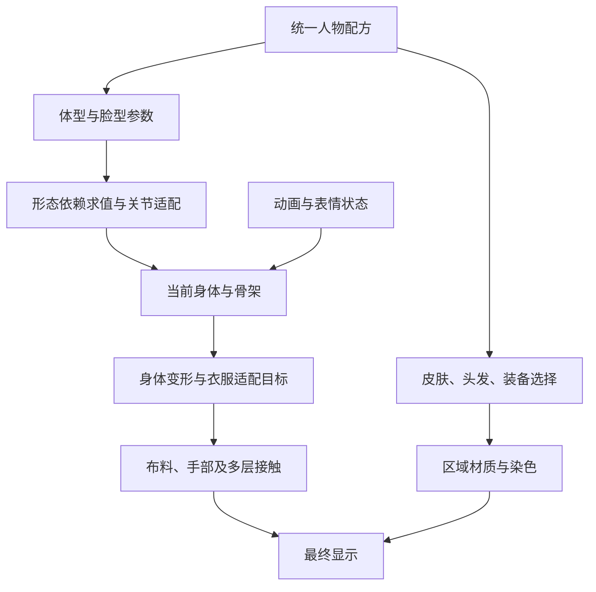

# VaM 与 Koikatu 捏人原理：从滑杆到完整人物

2026-09-27。用户确认此前说的“VRM 捏人”指 **VaM**；本章重点是原理与本项目的应用边界，供下次直接实施时查阅。VRM 是另一个资产格式话题，不作为本章研究对象。

结论：**VaM 的核心是预制顶点形态及其关节联动；Koikatu 的核心是预制多骨骼变换表及其组合。两者都把外观保存成参数配方，都依赖与基础身体配套的资产。成熟效果来自变形数据、骨架、衣服和更新顺序共同成立，不是一个通用“捏人算法”自动生成一切。**

本章依据用户本地安装的程序集静态分析，并读取了 Koikatu 的实际身体形态表。没有启动游戏逐个操作滑杆，没有验证所有插件组合，也没有把第三方实现搬进 RMMO。下文区分本地已确认机制与建议设计；静态调用关系不等于完成运行验收。

## 一、先把五件不同的事分开

| 层次 | 解决的问题 | 不能代替什么 |
|---|---|---|
| 身份形态 | 这个人的脸型、体型、比例是什么 | 不是当前动作，也不是皮肤材质 |
| 骨架与蒙皮 | 当前姿态下身体如何弯曲，关节位于哪里 | 不自动保证衣服合身 |
| 服装适配 | 衣服在这个体型上应处于什么形状和位置 | 不自动解决走动、坐下时的接触 |
| 动态接触 | 身体、手、裙子和多层布料如何互相作用 | 不能替代正确的静态版型与绑定 |
| 表面外观 | 肤色、粗糙度、法线细节、染色、妆容 | 不修复错误轮廓或蒙皮 |

表情是另一个状态层：可以使用与捏脸相同的形态键技术，但“这个人的嘴形”和“这个人正在笑”应分别存储、组合。不能播放表情后永久改掉人物身份。

这是依赖关系示意，不是两款游戏逐帧回调顺序的逐字还原。具体线程、缓存及引擎 modifier 的执行时机必须另行验证。

## 二、VaM：形态数据改变表面，公式让骨架一起变化

### 2.1 滑杆背后是稀疏顶点位移

`DAZMorph` 保存形态标识、显示名、默认值、范围、当前值、已应用值、公式以及形态数据加载信息。`DAZMorphVertex` 保存一个顶点索引和三维位移。一个形态只需记录发生变化的顶点，不必另存整个人物网格。

概念上，静态形态满足：

`形态后顶点 = 基础顶点 + Σ(形态权重 × 对应顶点位移)`

例如调大某处围度，使用的是作者制作好的表面位移；它可以同时改变正面、侧面和过渡区域，不限于把一块区域等比例放大。**顺滑与否首先取决于基础网格和形态数据质量，公式本身不会创造漂亮的解剖结构。**

本地 `LoadDeltasFromBinaryFile` 读取一个 int32 数量，之后每条记录为 int32 顶点索引与三个 float32，共 16 字节。这里只确认读取实现，尚未建立全部本地形态资产的可用清单。顶点数量相同也不代表兼容：拓扑、索引顺序、坐标约定都必须一致。

### 2.2 拖动时可以增量更新，但必须有稳定基准

`DAZMorphBank.ApplyMorphsThreadedFast` 处理变化的形态，并利用“新值减已应用值”更新顶点：

`当前顶点 += (新权重 - 已应用权重) × 位移`

这省去每次从头叠加全部形态，也解释了为什么需要区分默认值、当前值和已应用值。恢复配方、换基础身体、重新加载数据时必须同步这些状态；否则重复应用会越捏越偏。RMMO 应保留从基础数据完整重算的校验路径，不只依赖增量缓存。

### 2.3 一个滑杆可以联动其它形态和骨骼

已确认的公式类型包括驱动其它形态，以及改变骨骼中心、朝向和旋转。代码还处理组合形态关系。因此“腿变长”不能只让腿部顶点移动：相应关节与绑定相关数据也要同步，否则静止看似正确，一屈膝就会变形。

这里有两种容易混淆的校正：

- **身份校正**：体型变化后，关节位置、身体表面和配套衣服目标应一致。
- **姿态校正**：关节弯曲后，利用蒙皮、bulge 或配套校正数据维持合理形状。

本地 VaM 对公式传播存在有界重复求值。不能把它描述为已经提供任意复杂依赖的无环保障。RMMO 的建议是导入时检查缺失依赖与环，再建立确定的求值顺序；这是我们的设计建议。

### 2.4 衣服怎样跟着捏人

已有换装调查确认源系统含身体表面绑定数据：衣服记录对身体三角面及局部偏移的引用。身体表面变化时，重建相应局部坐标框架，便可得到新的服装目标位置。RMMO 已有同类表面适配实现，详见 [当前衣服运行时](female_surface_wardrobe.md)。

它解决的是“衣服如何跟随身体”，并不保证任意新体型都保持原版型。大幅拉伸、身体区域互相靠近、衣服多层与宽裙摆，仍需要合适绑定、有效范围和必要校正。动态模拟还要在目标形状之外处理惯性、接触及形状保持。

尤其是手自然垂下时：**应由裙子侧面受压产生变化，不能让手臂自动张开来绕开接触。** 表面适配正确也不能证明手掌、手指碰撞已经正确；两项必须分别验收。

### 2.5 材质与配方独立管理

`DAZCharacterTextureControl` 按身体区域组织贴图，并区分 Diffuse、Specular、Gloss、Normal、Detail、Decal 等类型。这说明自然肤质不是涂一个颜色，而是颜色、细节与反射响应的组合。跨引擎不能直接把 Gloss 数值当成目标引擎的 Roughness；需核对贴图语义、色彩空间和 shader。

`DAZMorph.StoreJSON` 存形态标识、名字及必要的值，外观恢复由 JSONStorable 体系处理。卡片/预设主要保存配方与引用，不等于随身带齐所有身体、形态和纹理资产。本地恢复路径中也存在按显示名查找的行为，RMMO 不应因此照搬显示名作为唯一键。

## 三、Koikatu：滑杆采样作者预制的多骨骼变换

### 3.1 参数不是随意缩放一个骨头

本地基础定义列出 44 个身体形态参数、52 个脸部形态参数，身体默认形态值通常为 0.5。这里的 52 是捏脸参数数量，**不是 ARKit 的 52 个表情通道**，也不包含安装插件增加的所有控制。

核心路径：

`UI → ChaFile 的形态数值 → SetShapeBodyValue / SetShapeFaceValue → ShapeInfoBase.ChangeValue → 多骨骼变换表 → ShapeBodyInfoFemale / ShapeHeadInfoFemale → 实际骨架`

`ShapeInfoBase` 的分类表规定“某参数影响哪些源骨骼、使用位置/旋转/缩放的哪些轴”。`AnimationKeyInfo.GetInfo` 根据滑杆值在作者制作的关键采样之间插值：位置与缩放使用向量插值，角度使用角度插值。

实际读取的 `cf_custombody` 包含例如身高类别对应多项源骨骼的记录；`cf_anmShapeBody` 则保存身体形态采样。身体输出阶段还组合多份源数据，例如位置相加、缩放相乘，以及左右镜像与校正逻辑。

因此它不是“给每根骨头加一个缩放滑杆”。成熟部分是**预先定义好一个语义参数怎样协调多个骨骼、轴向与修正项**。运行时只是执行这套制作好的规则。

### 3.2 为什么这种方案适合统一风格的人物

骨骼变换经过已有权重影响网格，同一组变化可以一起带动脸、身体和服装。基础身体、细分区域、辅助骨骼和衣服权重都按这条路线制作，才能得到可控效果。

适用边界也很明确：骨骼缩放不等于任意细节雕刻。很局部的轮廓或精细表情可能仍需要其它变形技术和资产。本地还存在 MorphBase，不能把“捏体型主路径使用骨骼表”扩大成“整个游戏完全不用形态键”。

### 3.3 换装成立的前提是同一骨架约定

`LoadCharaFbxDataAsync` 加载装备后，按身体或头部路径分配骨骼引用，并重新关联动态骨链所需根节点、排除节点和碰撞体。衣服因此能跟随同一角色骨架变化。

这不代表导入任意裙子后会自动合身，更不代表系统在运行时自动生成正确权重。资产须事先有匹配的骨骼、权重和部件约定；衣服自身的隐藏状态、材质与动态组件也属于配套数据。

骨链动力学与连续布料接触的能力边界不同。不能因为看到裙子会摆，就推断它已经解决手指压裙、多层布料自碰撞或所有坐姿。

### 3.4 变化按职责更新，避免每个滑杆重建整个人

`ChaControl` 设置身体、脸部和相关动态更新标记，在后续更新阶段消费；部分低精度路径还限制参数范围。这是明确的支持范围和更新调度，不是无限制组合必然正确。

纹理另走创建/混合流程，例如脸部妆容与图层、眼睛纹理和颜色、衣服图案与染色。滑杆改变围度不该重新加载所有贴图，改发色也不该重建骨架。这一职责划分值得复用，具体性能优化仍排在视觉正确之后。

### 3.5 角色卡保存配方，换装配方可以独立

已确认本地读取器先越过 PNG 图像，再读取标识、版本、块头与各数据块；身体、脸、头发、衣服等数据采用 MessagePack 结构。`ChaFileCoordinate` 将穿搭作为独立数据组织。

可借鉴的原则是：身份、穿搭、当前动作分别存；资源用稳定引用；块有版本；丢资源要能说明缺什么。没有必要复制它的文件格式才能获得这些好处。

### 3.6 当前安装的插件不能当作原版功能

本地存在 KKABMX、MaterialEditor、MoreAccessories、ClothColliders 等插件。静态确认 ABMX 的骨骼修改建立在采集到的基准变换之上：位置加偏移、旋转组合偏移、缩放乘倍率，并使用扩展数据保存。它还协调原人物更新与重新采集基准的时机。

关键经验是：**用户自定义偏移应相对确定基准计算，不能每帧在上一帧结果上叠加。** 改了基础体型后，旧基准也可能失效。其余插件本轮仅作存在与接口线索记录，没有逐项运行验证，不能据名称声称其已解决我们的碰撞问题。

## 四、共同原则与差异

| 问题 | VaM 主路径 | Koikatu 主路径 | 对 RMMO 的意义 |
|---|---|---|---|
| 滑杆驱动什么 | 稀疏顶点形态、依赖公式与关节联动 | 多骨骼 TRS 采样表和组合规则 | 不把两种资产当作可直接互换 |
| 品质从哪里来 | 好的基础网格、形态与蒙皮数据 | 配套骨架、权重和作者预制规则 | 引擎节点不能补出缺失美术 |
| 衣服怎样跟随 | 已调查的表面绑定与后续模拟 | 共享骨架引用及配套权重/动态组件 | 先明确衣服采用哪个适配契约 |
| 极端组合 | 可能需联动形态与范围约束 | 可能需校正、范围约束和配套资产 | 必须测参数组合，不能只测单滑杆 |
| 数据状态 | 默认值、当前值、已应用值等 | 基础参数、采样结果、更新标记等 | 缓存可重建，避免累计漂移 |
| 外观保存 | JSON 配方及资源引用 | 带图像的分块参数文件及资源引用 | 沿用统一配方，不存一份独立人体副本 |
| 动态正确性 | 表面适配之外仍需模拟和接触 | 蒙皮之外仍需动态与碰撞 | 捏人成功不等于裙装动作成功 |

## 五、落到 RMMO：借原理，不拼接两套人物系统

以下是基于当前工程的建议，尚未完成接入：

1. **保留已认可的女性基础身体及分轴蒙皮。** 以兼容的 VaM 形态数据和必要关节公式扩展身份形态。导入前核对基础拓扑、坐标和完整依赖，不能只导一个位移文件就宣称一个滑杆完成。
2. **借鉴 Koikatu 的参数组织和调度。** 为用户展示“身高、肩宽”等有意义的参数，底层允许一个参数驱动多个形态/关节项。不能把 Koikatu 的骨名或变换表直接套到 Genesis 身体上。
3. **只扩展现有 `Customization` 配方。** 创建页、选角、玩家、NPC 和灯光验证场景共用解析与应用过程。身份、装备、材质设置与运行时姿态分层；角色之间只共享不可变资源，不共享可变权重和模拟状态。
4. **明确几何更新契约。** 身份形态与关节适配完成后，动画的最终姿态才能进入当前身体求解；服装、接触和附着物必须读取同一次更新的结果。当前 `set_angles()` 立即启动 GPU 求解，接内置 modifier 前要解决时序，不能仅挂节点。
5. **参数定义与美术数据共同交付。** 建议每项包含稳定 ID、分类、显示名、默认值、范围、驱动项、依赖、受影响区域与版本。没有匹配数据的功能不能放一个无效滑杆；组合支持范围必须可说明。
6. **材质统一响应，允许分区贴图。** 脸和身体可以有不同贴图，但应共享约定的肤色与反射响应；用原灯光场景验证接缝、明暗、细节和不同视角，不再以一团亮色代替肤质。
7. **形态适配与布料实现分别选型。** 已有绑定数据继续保留。动态求解优先按现有研究试用内置/插件，并验证能否接收真实身体表面。插件不能替代我们提供正确的形态、碰撞输入和统一配方。

## 六、下次用三个小闭环验证原理落地

| 闭环 | 最小内容 | 必须能观察到的结果 |
|---|---|---|
| 体型—关节—衣服 | 一个明确带关节变化的体型参数，一件现有复杂裙，静止及弯曲动作 | 体型改变、关节仍对位、衣服目标同步；还原参数不漂移。自然垂手不因裙子而外张。 |
| 材质—区域一致性 | 原灯光场景中调整一套皮肤参数，检查脸、颈、手臂与身体 | 不重建人物；分区衔接和反射合理；两个角色互不串材质状态。 |
| 配方—正式入口 | 保存并恢复同一体型/装备/材质组合，经过创建、选角与实际玩家路径 | 结果一致；缺资源有明确结果；旧配方可迁移。先用客户端/mocker，不扩展 Go 持久化。 |

这三个闭环不是最终验收的全部。随后仍需体型组合、不同裙装、走动/抬腿/坐下/躺下及近景接触检查。顺序维持 **视觉与完整人物流程 → 性能 → 新增 MMD 二次元表情与标签**，详见 [下次开工入口](character_next_session_plan.md)。

## 七、证据索引与未确认边界

外部研究目录：`D:/code/rmmo_runtime/review_artifacts/character_3d/customization_research/`。完整反编译文本留在外部，仅用于本地研究；工程内记录原理与索引。`source_hashes.json` 记录本轮两个主程序集及 ABMX 的 SHA256，防止下次把另一版本当本次依据。

| 要复核的结论 | 目录内文件与入口 |
|---|---|
| VaM 形态结构与二进制布局 | `vam_DAZMorph.cs`：`LoadMetaFromJSON`、`LoadDeltasFromBinaryFile`、`StoreJSON`；`vam_DAZMorphVertex.cs` |
| 增量形态与骨骼公式 | `vam_DAZMorphBank.cs`：`ApplyMorphsThreadedFast`、`ApplyBoneMorphs`；`vam_DAZMorphFormula.cs` |
| 人物更新衔接 | `vam_DAZCharacterRun.cs`；`vam_DAZBone.cs`、`vam_DAZBones.cs` |
| VaM 区域材质与配方 | `vam_DAZCharacterTextureControl.cs`；`vam_GenerateDAZMorphsControlJSONStorable.cs` |
| Koikatu 参数数量与默认值 | `kk_ChaFileDefine.cs`、`kk_ChaFileBody.cs`、`kk_ChaFileFace.cs` |
| 滑杆到骨架 | `kk_ChaControl.cs`：`SetShapeBodyValue`、`SetShapeFaceValue`、`LateUpdateForce`；`kk_ShapeInfoBase.cs`：`ChangeValue`；`kk_AnimationKeyInfo.cs`：`GetInfo`；两个 `Shape*InfoFemale` 文件 |
| 实际身体表 | `kk_shape_assets.json`、`kk_asset_cf_custombody.bin`、`kk_asset_cf_anmShapeBody.bin`；来自 `abdata/list/customshape.unity3d` 与 `abdata/chara/oo_base.unity3d` |
| 衣服挂接和材质 | `kk_ChaControl.cs`：`LoadCharaFbxDataAsync`、`CreateFaceTexture`、`ChangeCustomClothes`；`kk_ChaClothesComponent.cs` |
| 角色卡/穿搭保存 | `kk_ChaFile.cs`：`LoadFile`；`kk_ChaFileCoordinate.cs` 与 `kk_ChaFileControl.cs` |
| ABMX 基准与偏移 | `abmx_KKABMX.Core.BoneController.cs`、`abmx_KKABMX.Core.BoneModifier.cs` |

未确认的项目：全部 VaM 形态资产和许可/依赖覆盖；所有体型组合下的画面；Koikatu 完整脸部采样资产的位置与效果；当前安装全部插件的运行交互；两套游戏完整线程时序；这些机制接入 RMMO 后的实际帧成本。不能把“原理已查明”写成“资产齐全、效果和性能已通过”。
